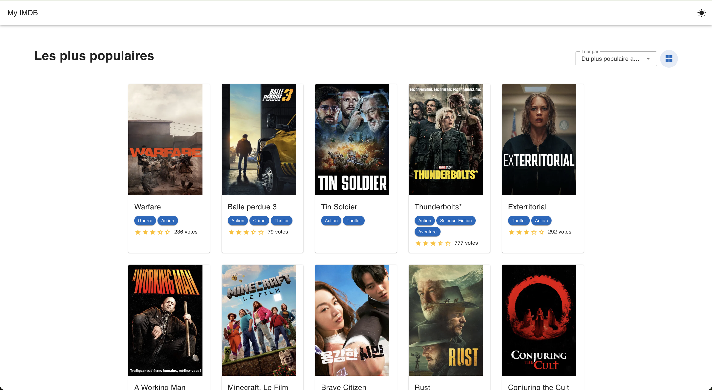
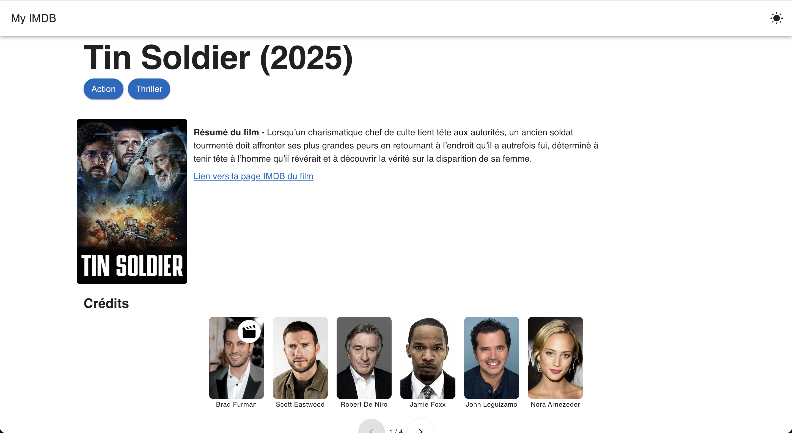
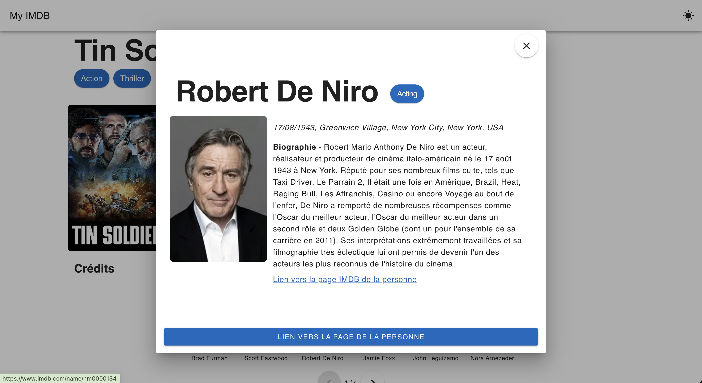
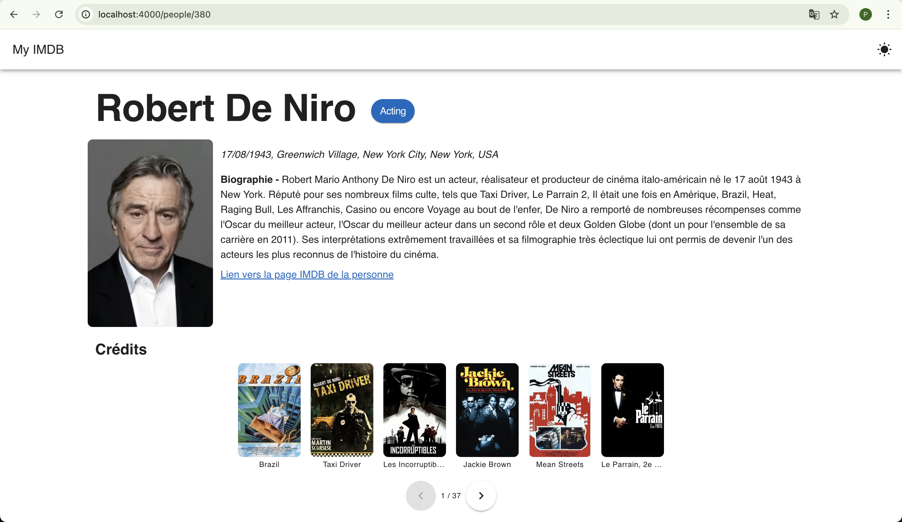

# IMDB POC - Vue Version

A modern Vue.js application that demonstrates best practices in building a movie database interface. Built with Vue 3, TypeScript, Vuetify, and Pinia.

## Features

- 🚀 Vue 3 with Composition API for better code organization and reusability
- 📘 TypeScript for type safety and better developer experience
- 🎨 Vuetify 3 for Material Design components and theming
- 📦 Pinia for efficient state management
- 🛣️ Vue Router with lazy loading for optimal performance
- 🧪 Vitest and Testing Library for comprehensive testing
- 📱 Responsive design for all screen sizes

## Tech Stack

- **Framework**: Vue 3.5
- **Language**: TypeScript
- **UI Library**: Vuetify 3.8
- **State Management**: Pinia 3.0
- **Routing**: Vue Router 4.5
- **Testing**: Vitest, Vue Test Utils, Testing Library
- **Build Tool**: Vite 6.3
- **Package Manager**: pnpm

## Getting Started

### Prerequisites

- Node.js (v18 or higher)
- pnpm (v8 or higher)

### Installation

```sh
# Clone the repository
git clone <repository-url>

# Navigate to project directory
cd vue-imdb

# Install dependencies
pnpm install
```

### Development

```sh
# Start development server
pnpm dev

# Run type checking
pnpm type-check

# Run linting
pnpm lint

# Format code
pnpm format
```

### Testing

```sh
# Run tests
pnpm test

# Run tests with coverage
pnpm test:coverage
```

### Production

```sh
# Build for production
pnpm build

# Preview production build
pnpm preview
```

## Project Structure

```
src/
├── assets/          # Static assets (images, styles)
├── components/      # Reusable Vue components
│   ├── MovieCard.vue
│   ├── MovieListItem.vue
│   └── Modal.vue
├── router/          # Vue Router configuration
├── services/        # API services and utilities
├── stores/          # Pinia stores
├── types/           # TypeScript type definitions
├── views/           # Page components
│   ├── HomeView.vue
│   ├── MovieDetailView.vue
│   └── PeopleDetailView.vue
├── App.vue          # Root component
├── main.ts          # Application entry point
├── constants.ts     # Application constants
└── types.ts         # TypeScript interfaces
```

## API Integration

The application integrates with a movie database API. Key endpoints:

- `GET /discover/movies` - Discover movies with filtering and pagination
- `GET /movies/:id` - Get detailed information about a specific movie
- `GET /people/:id` - Get detailed information about a person

## Component Documentation

### MovieCard

A card component that displays basic movie information including:

- Poster image
- Title
- Release date
- Rating

### MovieListItem

An alternative view for displaying movies in a list format, showing:

- Thumbnail
- Title
- Overview
- Release date

### Modal

A reusable modal component used for displaying:

- Movie details
- Person details
- Any other modal content

## State Management

The application uses Pinia for state management with the following stores:

- `movies` - Manages movie-related state and actions
  - Movie list
  - Selected movie
  - Pagination
  - Filters

## Screenshots

<div align="center">
  
  
  
  
</div>

## Contributing

1. Fork the repository
2. Create your feature branch (`git checkout -b feature/amazing-feature`)
3. Commit your changes (`git commit -m 'Add some amazing feature'`)
4. Push to the branch (`git push origin feature/amazing-feature`)
5. Open a Pull Request

## License

This project is licensed under the MIT License - see the [LICENSE](LICENSE) file for details.
